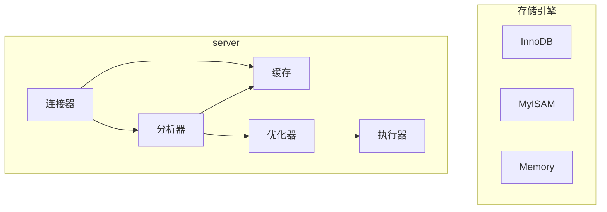

## mysql基本架构

+ Serve层

  + 连接器

    负责和客户端建立连接、获取权限、维持和管理连接

  + 缓存

    之前执行过的select语句及其结果可能会以key-value的形式存在缓存中，如果缓存中能命中，就直接返回缓存的结果。当表内容被更新(包括delete和update)，这个表关联到的所以缓存都会失效，所以不应该依赖这个机制来做优化。Mysql 8.0 以后缓存被取消。

  + 分析器

    1. 词法分析
    2. 语法分析

  + 优化器

    对需要执行的sql进行优化，例如选择哪个索引和决定连表顺序。然后会制定执行方案。

  + 执行器

    首先会检查连接是否有这些表的执行权限，然后会根据执行方案使用存储引擎的接口来执行。

+ 存储引擎

  负责数据的存储和提取